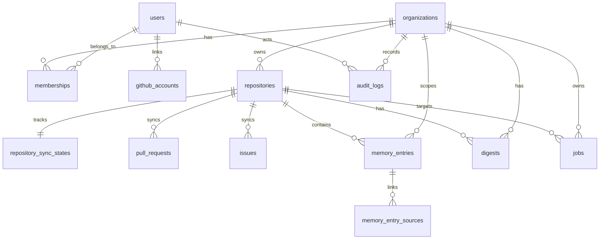

# ERD (v1)

## Purpose
RepoMemory v1 stores GitHub repository context (PRs/issues), derived memory entries, digests, and operational history for jobs and auditing.

## Entity overview
- `users`: app users (auth-light for now, email nullable).
- `organizations`: tenant boundary for all data access.
- `memberships`: user-to-organization membership with `owner`/`member` role.
- `github_accounts`: linked GitHub identities and token storage placeholder.
- `repositories`: imported GitHub repositories under an organization.
- `repository_sync_states`: per-repo sync checkpoint and last error/status.
- `pull_requests`: synced PR records from GitHub.
- `issues`: synced issue records from GitHub.
- `memory_entries`: generated or manual memory artifacts for repository context.
- `memory_entry_sources`: explicit linkage from memory entries to PR/issue source records.
- `digests`: weekly (or arbitrary period) summary artifacts per repository.
- `jobs`: async/sync job lifecycle tracking and payload metadata.
- `audit_logs`: immutable event log for important actions.

## Relationship map
- `organizations 1--* memberships`
- `users 1--* memberships`
- `users 1--* github_accounts`
- `organizations 1--* repositories`
- `repositories 1--1 repository_sync_states`
- `repositories 1--* pull_requests`
- `repositories 1--* issues`
- `organizations 1--* memory_entries`
- `repositories 1--* memory_entries`
- `memory_entries 1--* memory_entry_sources`
- `organizations 1--* digests`
- `repositories 1--* digests`
- `organizations 1--* jobs` (nullable)
- `repositories 1--* jobs` (nullable)
- `organizations 1--* audit_logs` (nullable)
- `users 1--* audit_logs` (nullable as actor)

## Mermaid ERD

## Intentional v1 simplifications
- No soft-delete columns by default; records are hard-deleted only where cascade semantics are explicit.
- PR/issue labels stored as `jsonb` arrays to keep sync pipeline simple.
- `memory_entry_sources.source_record_id` is polymorphic UUID (no FK) because it can reference either PR or issue rows.
- No billing/team hierarchy tables yet.
- No full-text search implementation yet; indexed for later extension.